# 🛡️ 封鎖機制架構文件 (Blocking Architecture)

> **⚠️ 重要：任何涉及封鎖流程的修改前，必須先閱讀此文件。**
> 本文件記錄了所有封鎖路徑、平台差異、以及已知的 iOS 安全限制與對應解法。

---

## 平台偵測

```
Utils.isMobile() → true:  iOS / iPadOS (包含偽裝為 MacIntel 的 iPad)
Utils.isMobile() → false: Desktop (Mac/Windows/Linux)
```

偵測邏輯位於 `src/utils.js`，iPad 透過 `navigator.platform === 'MacIntel' && navigator.maxTouchPoints > 1` 判定。

---

## 三種封鎖路徑總覽

```mermaid
graph TD
    A[使用者按下「開始封鎖」] --> B{Utils.isMobile?}
    B -->|Mobile| C[Core.runSameTabWorker]
    B -->|Desktop| D{MAC_MODE?}
    D -->|foreground| E[Core.runForegroundBlock]
    D -->|background| F[window.open → Worker]

    C --> G[history.replaceState + reload]
    G --> H[Worker.init → runStep 循環]
    H --> I[history.replaceState 逐一跳轉]
    I --> J[Worker.autoBlock 執行封鎖]
    J --> K[完成 → navigateBack 返回原頁]

    E --> L[在當前頁面模擬點擊 ... 按鈕]
    F --> M[新分頁中執行 Worker]
```



---

## 路徑 1：Mobile 同分頁 Worker (`runSameTabWorker`)

**檔案**：`core.js` → `worker.js`
**適用**：iOS / iPadOS
**入口**：`main.js:handleMainButton` → `Core.runSameTabWorker()`

### 流程

1. 將 `pendingUsers` 合併至 `BG_QUEUE` (localStorage)
2. 儲存 `hege_return_url` = 當前頁面 URL（去除 `hege_bg` 參數）
3. **`history.replaceState`** 修改 URL 為 `/?hege_bg=true`
4. **`location.reload()`** 重新載入頁面
5. 頁面載入後，`main.js` 偵測 `hege_bg=true` → 呼叫 `Worker.init()`
6. Worker 顯示全螢幕進度 UI
7. `Worker.runStep()` 逐一處理佇列：
   - 以 **`history.replaceState`** + `reload` 跳轉到 `/@username?hege_bg=true`
   - 執行 `Worker.autoBlock()` 自動化封鎖流程
8. 佇列清空後，`Worker.navigateBack()` 以 **`history.replaceState`** + `reload` 返回原頁

### ⛔ iOS 安全限制（絕對不能違反）

| 禁止行為 | 原因 |
|---|---|
| `window.location.href = 'threads.net/...'` | 觸發 **Universal Links**，開啟原生 Threads App |
| `window.open(...)` | 被 Safari **彈出視窗阻擋器**攔截 |
| `<iframe src="threads.net">` | UserScript **不會注入** iframe |
| click handler 內直接 `location.href` | 即使 setTimeout(0) 也可能觸發 Universal Links |

### ✅ 唯一安全的導航方式

```javascript
history.replaceState(null, '', newPath);
location.reload();
```

這不是「導航到新頁面」，而是「修改當前 URL + 重新整理」，Safari 不會觸發 Universal Links。

---

## 路徑 2：Desktop 背景分頁 Worker (`window.open`)

**檔案**：`main.js` → `worker.js`
**適用**：Desktop（`MAC_MODE === 'background'`，預設值）

### 流程

1. 將 `pendingUsers` 合併至 `BG_QUEUE`
2. `window.open('https://www.threads.net/?hege_bg=true', ...)` 開啟新分頁
3. 新分頁載入 → `Worker.init()` → `Worker.runStep()` 循環
4. Worker 以 `window.location.href` 逐一跳轉（Desktop 不受 Universal Links 影響）
5. 完成後 `window.close()` 關閉分頁

### 跨分頁通訊

- Worker 透過 `localStorage` (BG_STATUS, BG_QUEUE) 與主分頁同步狀態
- 主分頁透過 `window.addEventListener('storage', ...)` + `setInterval` 輪詢更新 UI

---

## 路徑 3：Desktop 前景模擬 (`runForegroundBlock`)

**檔案**：`core.js`
**適用**：Desktop（`MAC_MODE === 'foreground'`）

### 流程

1. 遍歷 `Core.blockQueue`（畫面上已勾選的 `...` 按鈕 DOM 元素）
2. 對每個按鈕：
   - `scrollIntoView` → `simClick` 點擊 `...` 按鈕
   - 等待選單出現 → 點擊「封鎖」
   - 等待確認對話框 → 點擊確認
3. 記錄至 DB，隱藏已封鎖的貼文

### ⚠️ 限制

- **只能處理畫面上有 `...` 按鈕的使用者**（`Core.blockQueue` 內的 DOM 元素）
- 無法處理「同列全封」或「匯入清單」的使用者（這些只有 username 字串，沒有 DOM 按鈕）
- 因此 **Mobile 不使用此路徑**

---

## 其他觸發封鎖的入口

### 同列全封 (`handleBlockAll`)

**檔案**：`core.js:injectDialogBlockAll`
**行為**：將對話框（如「貼文動態」、「讚」）中的所有使用者加入 `pendingUsers`
**不直接執行封鎖**，使用者需回到面板點擊「開始封鎖」

#### iOS 觸控事件處理

```javascript
// Mobile: touchstart + touchend 搭配 preventDefault
blockAllBtn.addEventListener('touchend', (e) => {
    e.stopPropagation();
    e.preventDefault(); // 防止合成 click 觸發 Universal Links
    handleBlockAll(e);
}, { passive: false });

// Desktop: 原生 click
blockAllBtn.addEventListener('click', handleBlockAll);
```

### 重試失敗清單 (`retryFailedQueue`)

**檔案**：`core.js`
**行為**：將 `FAILED_QUEUE` 中的使用者移回 `BG_QUEUE`，然後：
- Mobile → `Core.runSameTabWorker()`
- Desktop → `window.open(...)`

### 匯入清單 (`importList`)

**檔案**：`core.js`
**行為**：解析使用者輸入的 ID 清單，過濾已封鎖的，加入 `BG_QUEUE`，然後：
- Mobile → `Core.runSameTabWorker()`
- Desktop → `window.open(...)`

---

## UI 面板事件綁定

**檔案**：`ui.js:createPanel`

面板按鈕統一使用**原生 `click` 事件**（不使用 touchend + preventDefault）。

**原因**：面板 `#hege-panel` 直接掛在 `document.body`，不在任何 `<a>` 標籤內部，因此不會觸發 Universal Links。而且保留原生 click 可以確保 Safari 的安全性政策允許後續操作（如 `confirm()`、`prompt()` 等）。

---

## Checkbox 事件綁定

**檔案**：`core.js:scanAndInject`

Checkbox 嵌入在 Threads 的 DOM 樹中（貼文旁邊的 `...` 按鈕附近），底下可能有 `<a href="/@username">` 連結。

```
Mobile:  touchstart(stopPropagation) + touchend(stopPropagation + preventDefault + handleGlobalClick)
Desktop: click(handleGlobalClick, capture: true) + ontouchend(stopPropagation)
```

**`preventDefault` 在這裡是必要的**，因為 iOS Safari 會將 touchend 合成為 click 事件，該 click 可能穿透到底下的 `<a>` 標籤觸發 Universal Links。

---

## 資料儲存 (Storage Keys)

| Key | 類型 | 說明 |
|---|---|---|
| `hege_block_db_v1` | localStorage (JSON) | 已封鎖使用者歷史 |
| `hege_pending_users` | sessionStorage (JSON) | 當前選取的使用者 |
| `hege_active_queue` | localStorage (JSON) | 背景 Worker 的待處理佇列 |
| `hege_bg_status` | localStorage (JSON) | Worker 狀態 (state, current, progress, total, lastUpdate) |
| `hege_bg_command` | localStorage | Worker 控制指令 (如 'stop') |
| `hege_failed_queue` | localStorage (JSON) | 封鎖失敗的使用者 |
| `hege_return_url` | localStorage | Mobile Worker 完成後要返回的頁面 URL |

---

## Worker 自動封鎖流程 (`autoBlock`)

**檔案**：`worker.js`

```
1. 等待頁面載入 (2.5s)
2. Polling 尋找「更多」SVG 按鈕 (最多 12s)
   └─ 檢查 SVG 結構：circle + path ≥ 3
3. simClick 點擊「更多」按鈕
4. Polling 等待選單出現 (最多 8s)
   ├─ 偵測到「解除封鎖」→ return 'already_blocked'
   └─ 偵測到「封鎖」→ 點擊
5. Polling 等待確認對話框 (最多 5s)
   ├─ 偵測到限制訊息 → return 'cooldown'
   └─ 點擊紅色確認按鈕
6. 等待對話框關閉 (最多 8s)
   └─ return 'success' 或 'failed'
```

### 結果處理

| 結果 | 處理 |
|---|---|
| `success` / `already_blocked` | 從 BG_QUEUE 移除，加入 DB_KEY |
| `failed` | 從 BG_QUEUE 移除，加入 FAILED_QUEUE |
| `cooldown` | 停止執行，顯示警告 |
